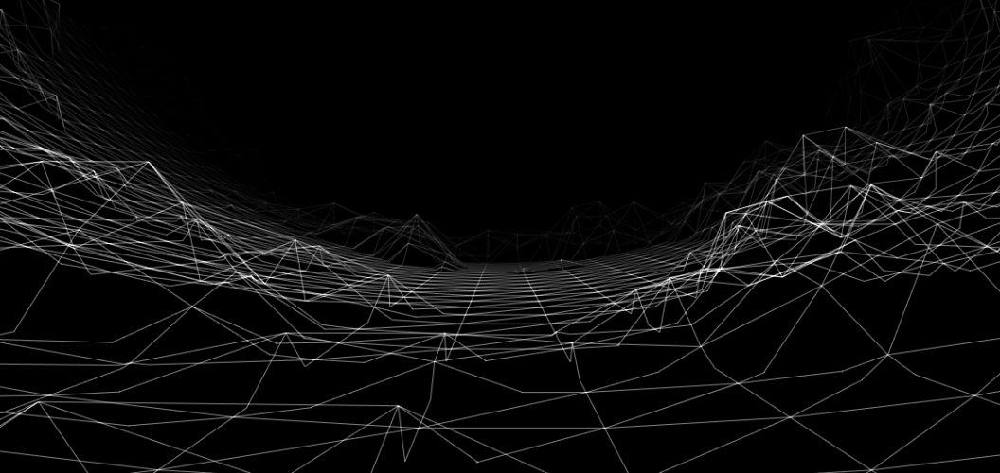

# 42 Cursus
fdf is the first project of the graphic branch of the cursus 42
fdf is a project in solo
I have use 2 librarie to realise this proejct
1 - my libft
2 - the minilibx (a graphic library of 42 school)

# 42-fdf
This project is about creating a simplified 3D graphic representation of a relief landscape

The representation in 3D of a landscape is a critical aspect of modern mapping. For
example, in these times of spatial exploration, to have a 3D representation of Mars is a
prerequisite condition to its conquest. As another example, comparing various 3D representations of an area of high tectonic activity will allow you to better understand these
phenomenon and their evolution, and as a result be better prepared.
It’s your turn today to modelize in 3D some magnificent landscapes, imaginary or
not...

for more information please read the PDF of the subject.
I put the subject in ressources/subject

# Compiling and execute
Run the command `make` a the root of the repo then
you can run the programm with `./fdf fdf_maps`

# fdf_maps
  

# Program output

